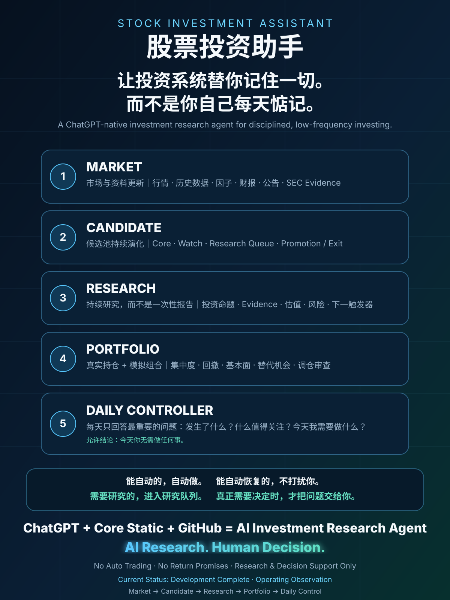

# Stock Investment Assistant｜股票投资助手

### A ChatGPT-native investment research agent for disciplined, low-frequency investing

> **让投资系统替你记住一切，而不是你自己每天惦记。**  
> **AI Research. Human Decision.**

<p align="center">
  
</p>

Stock Investment Assistant is a continuously operating investment-research agent built around **ChatGPT as the analysis engine**, **Core Static as the investment-discipline layer**, and **GitHub as the automation, governance and canonical-state layer**.

It is designed for investors who want a repeatable research process without turning the system into an auto-trading bot.

The system continuously maintains market data, candidate pools, research queues, portfolio states and review workflows, then answers the questions that matter most:

- What changed?
- What deserves attention?
- Is there a new risk or opportunity?
- Does anything require deeper research?
- **Do I need to do anything today?**

---

## Why this project exists

Most investors do not suffer from a lack of opinions. They suffer from a lack of **continuity, discipline and follow-through**.

Investment work is usually scattered across market apps, financial statements, company announcements, browser tabs, spreadsheets, watchlists and memory. The hard part is not collecting one more data point. The hard part is maintaining a consistent process over months and years.

Stock Investment Assistant turns that fragmented workflow into a persistent system:

```text
Investment Framework
        ↓
Market & Evidence
        ↓
Candidate Pool
        ↓
Research Queue
        ↓
Portfolio Review
        ↓
Daily Controller
        ↓
Human Decision
```

The system does not attempt to eliminate market uncertainty. It attempts to reduce avoidable process failures: forgotten follow-ups, stale watchlists, inconsistent reasoning, unreviewed positions and ad-hoc decisions.

---

## Core capabilities

### 1. Market & Evidence

Maintains research-grade inputs for low-frequency investment decisions, including:

- A-share market and historical data
- factor and screening outputs
- financial and valuation evidence
- company announcements and disclosures
- Hong Kong Stock Connect research data
- bounded U.S. equity / SEC evidence rotation
- necessary public external evidence

The goal is not to be a high-frequency market terminal. The goal is to determine whether new information changes the investment case.

### 2. Candidate Pool

Maintains a governed investment funnel rather than a permanent “recommended stocks” list.

Typical states include:

- `Core`
- `Watch`
- `Research Queue`
- `Shadow / Observation`
- `Ready for User Decision`

The system continuously evaluates admission, promotion, demotion, removal and replacement opportunities.

### 3. Portfolio Monitoring

Separately reviews real and simulation portfolios for:

- concentration risk
- drawdown and P&L
- style and factor exposure
- ETF / fund overlap
- fundamental changes
- valuation changes
- earnings and material announcements
- candidate replacement opportunities
- rebalance / exit-review triggers

Real and simulation states remain logically separated.

### 4. Research Queue

Research is treated as an evolving investment thesis, not a one-off report.

Each priority research object should answer:

- Why is this worth researching now?
- What is the current thesis?
- What evidence is still missing?
- What could falsify the thesis?
- What is the next catalyst or trigger?
- Is the evidence sufficient for an investment decision?

### 5. Daily Controller

The Daily Controller is the human-facing orchestration layer.

It combines market state, candidate state, research priorities, portfolio state, workflow health and new evidence into a concise investment cockpit.

A valid daily output is allowed to be:

> **今天你无需做任何事。**

The system does not manufacture trades merely to produce activity.

---

## Automation model

The assistant separates actions into five operating states:

| State | Meaning |
|---|---|
| `AUTO` | Completed automatically; no user action required. |
| `AUTO_RECOVERY` | Delayed or temporarily failed, but a natural recovery path exists. |
| `MANUAL_TRIGGER_REQUIRED` | The system knows the next action, but governance / permissions / scheduling require a user trigger. |
| `USER_INPUT_REQUIRED` | A real-world fact unavailable to the system is required, such as an actual trade or cash movement. |
| `USER_DECISION_REQUIRED` | A formal investment, candidate-governance or rebalance decision requires human approval. |

The design principle is simple:

> **Automate what can be automated. Recover automatically where possible. Interrupt the user only when human input or judgment is genuinely required.**

---

## Markets

### A-shares
Primary production market for market data, factor computation, screening, candidate operations and portfolio research.

### Hong Kong Stock Connect
Formal candidate pool with governed weekly observation and evidence-backed promotion / demotion proposals.

### U.S. equities
Bounded benchmark, research-rotation and SEC-evidence scope. It is **not** represented as a full U.S. daily investment-production system.

---

## Architecture

```text
ChatGPT
Analysis · Research · Reasoning
        +
Core Static
Investment Principles · Evidence Rules · Risk Discipline
        +
GitHub
Automation · Governance · Canonical State · Audit Trail
        ↓
AI Investment Research Agent
```

### ChatGPT
Primary analysis, research synthesis, judgment and natural-language interaction layer.

### Core Static
Stable investment principles, research standards, evidence discipline, candidate lifecycle rules, portfolio-review logic and learning / attribution rules.

### GitHub
Not just source control. In this project GitHub also provides:

- canonical state
- workflow automation
- version control
- research evidence lineage
- candidate state
- run history
- governance and audit trail

`main` is the canonical code/control branch. `operating-current` is the canonical runtime pointer and receipt branch. Historical `agent/*` and `automation/*` branches are temporary evidence or transport surfaces, not additional authorities.

---

## Current operating state

**S1 Simplification & Runtime Repair in progress**

The repository has substantial research, portfolio and runtime capability, but the 2026-08-31 end-to-end audit did **not** accept the system as a stable daily investment-decision chain. Development-era completion labels are therefore historical evidence, not the current whole-system maturity claim.

The sole system-level machine-readable authority is:

- [`investment_os_runtime/00_CONTROL/SYSTEM_CURRENT.json`](investment_os_runtime/00_CONTROL/SYSTEM_CURRENT.json)

Runtime freshness, latest attempts and last-known-good domain state are read from the `operating-current` branch via:

- `operating_current/OPERATING_CURRENT_INDEX.json`

Supporting S1 control files:

- [`investment_os_runtime/00_CONTROL/ACTIVE_WORKFLOW_REGISTRY.json`](investment_os_runtime/00_CONTROL/ACTIVE_WORKFLOW_REGISTRY.json)
- [`investment_os_runtime/00_CONTROL/BRANCH_POLICY.md`](investment_os_runtime/00_CONTROL/BRANCH_POLICY.md)

Legacy files such as `STOCK_INVESTMENT_ASSISTANT_CURRENT.json`, FMDL/WP/R0-R6 documents, and other files retaining `CURRENT` in their names may still be valid domain snapshots or historical development artifacts. They do not override `SYSTEM_CURRENT.json` for whole-system maturity or roadmap status.

---

## Repository map

| Path | Role |
|---|---|
| `.github/workflows/` | Scheduled production, validation, observation and controlled recovery workflows |
| `config/` | Data, evidence, market, candidate and governance contracts |
| `schemas/` | Canonical schemas and state contracts |
| `ingestion/` | Market / disclosure source adapters and fallbacks |
| `pipeline/` + `scripts/` | Normalization, QA, repair, factors, screening and production logic |
| `datasets/` | Historical / structured data layers |
| `outputs/current/` | A-share market Current |
| `outputs/history/current/` | Historical market Current |
| `outputs/factors/current/` | Factor Current |
| `outputs/investment_os/` | Unified system / ChatGPT read interface |
| `outputs/hk_candidate/current/` | Hong Kong candidate Current |
| `investment_os_runtime/` | Candidate, portfolio and operating runtime states |
| `docs/` | Architecture, contracts, acceptance and operating documentation |

The repository contains substantial historical engineering and acceptance evidence. The README intentionally presents the **current product and operating model** rather than reproducing the full development chronology.

---

## Typical usage

The normal user should not need to operate GitHub directly.

Examples:

```text
今天股票投资助手有什么值得我关注的？
```

```text
结合最新数据、候选池和我的持仓，
重新分析一下 XXX，现在是否值得买入或继续持有？
```

```text
研究一下 XXX，判断是否值得进入候选池。
```

```text
检查我的真实持仓，有没有需要调整的地方？
```

The Daily Controller is designed to surface scheduled work, research triggers and user-decision gates automatically.

---

## What this project is not

This project is **not**:

- a high-frequency trading system
- an auto-follow / copy-trading tool
- an automatic stock-picking promise
- a guaranteed-alpha engine
- an unattended broker execution bot

It does not have authority to place live orders.

```text
orders = 0
trade_authority = NONE
```

**Research & Decision Support Only**  
**No Automatic Trading**  
**Human Keeps Final Investment Authority**

---

## Public-repository privacy boundary

A reusable public version of this architecture should keep personal brokerage facts, real holdings, account identifiers and other private runtime state outside the public template or in a private overlay.

**Before redistributing or presenting this repository as a clean public template, audit `investment_os_runtime/` and other state paths for user-specific portfolio data.**

The investment framework and automation architecture are reusable; personal portfolio state is not part of the product definition.

---

## Philosophy

> **AI负责持续研究与纪律执行。投资者负责最终判断与资本决策。**

Stock Investment Assistant is an experiment in turning investing from a collection of isolated analyses into a persistent, auditable, AI-maintained research process.

The objective is not to promise better returns. The objective is to make the investment process more consistent, inspectable and difficult to forget.

---

## Disclaimer

This project is an experimental AI-assisted investment research system. It does not constitute investment advice, investment management, brokerage, trading execution or any guarantee of future returns.

All investment decisions and trading actions remain the sole responsibility of the user.
